# 🗄️ Company Database - Schema Implementation & SQL Queries (Lab 2)

## 📌 Overview
This project focuses on implementing the physical database schema for the **Company Database** using **MS SQL Server (T-SQL)**. It includes table creation with primary/foreign key constraints, data insertion, database diagram generation, and solving 9 relational SQL queries (DML & DDL).

---

## ⚙️ Key Features & Tasks Implemented
1. **Schema Creation**: Built tables (`Employee`, `Department`, `Project`, `Works_for`, `Dependent`) with full referential integrity and constraints.
2. **Database Diagram**: Established foreign key relationships between all entities.
3. **Data Manipulation & Retrieval (DML)**: Solved 9 SQL queries covering:
   - Data filtering using `WHERE` clauses.
   - Column aliases and computed fields (e.g., Annual Commission calculation).
   - Multi-condition filters (Salary, Gender, Department/Project management).

---

## 📊 Database Diagram & Execution Screenshots

### 🖼️ Relational Schema Diagram
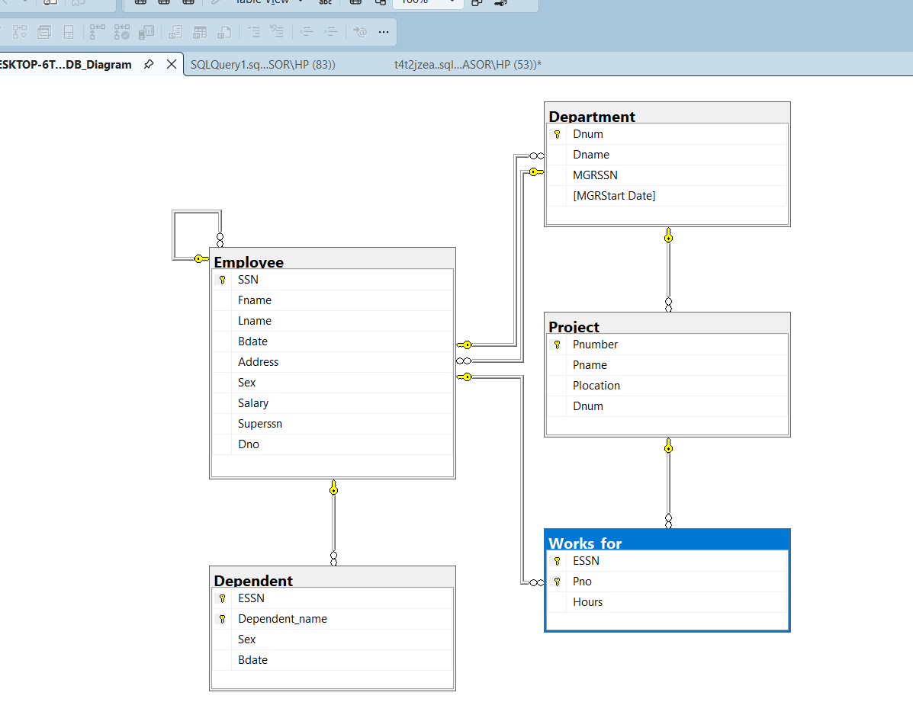

### 📸 Query Results & Tasks
| Task | Description | Screenshot |
| :--- | :--- | :---: |
| **Tables Creation** | Database Tables Structure | 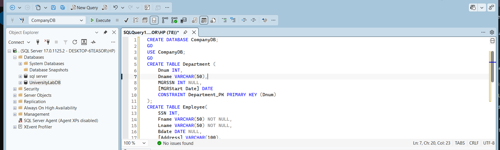 |
| **Task 1** | Display all employee data | 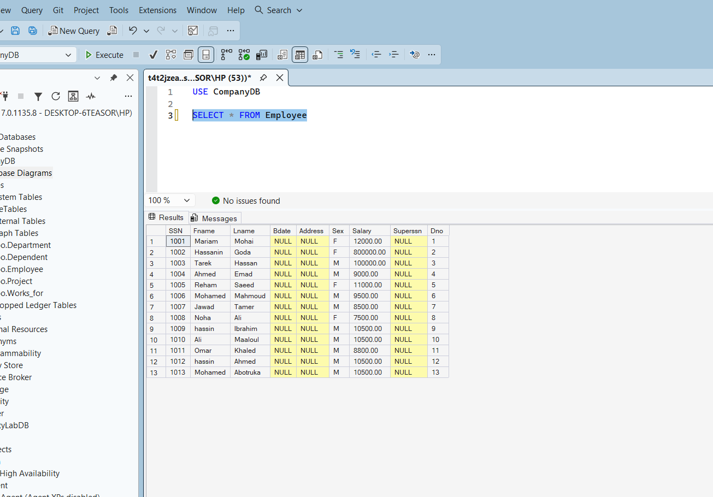 |
| **Task 2** | Display First Name, Last Name, Salary, and Department Number | 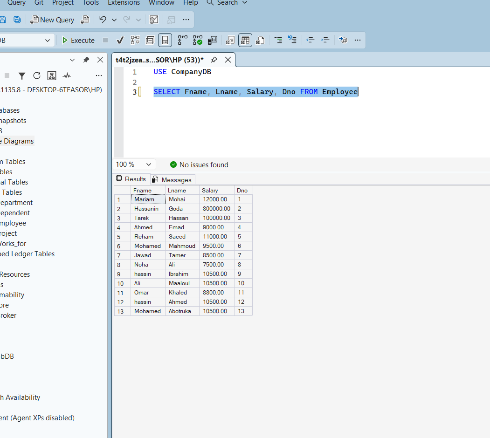 |
| **Task 3** | Display Project Names, Locations, and Managing Department | 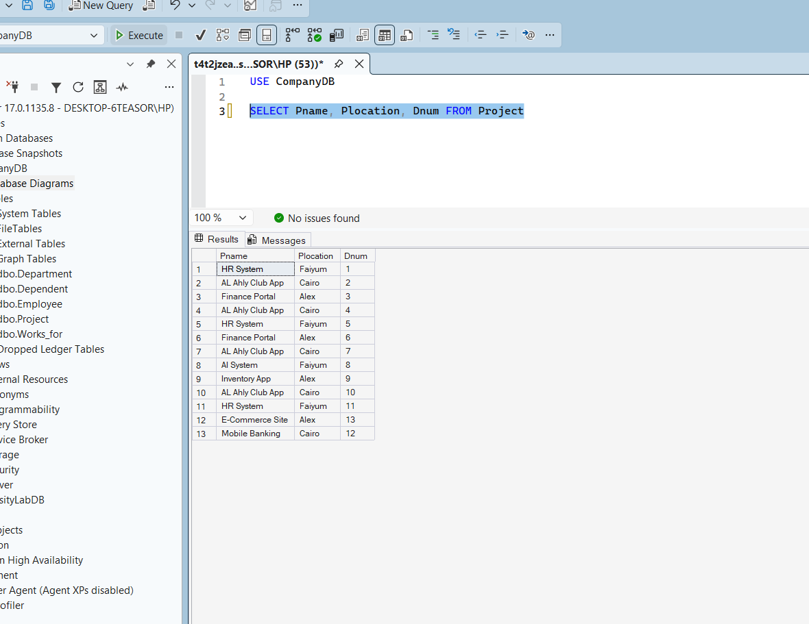 |
| **Task 4** | Display Full Name and Annual Commission (10%) | 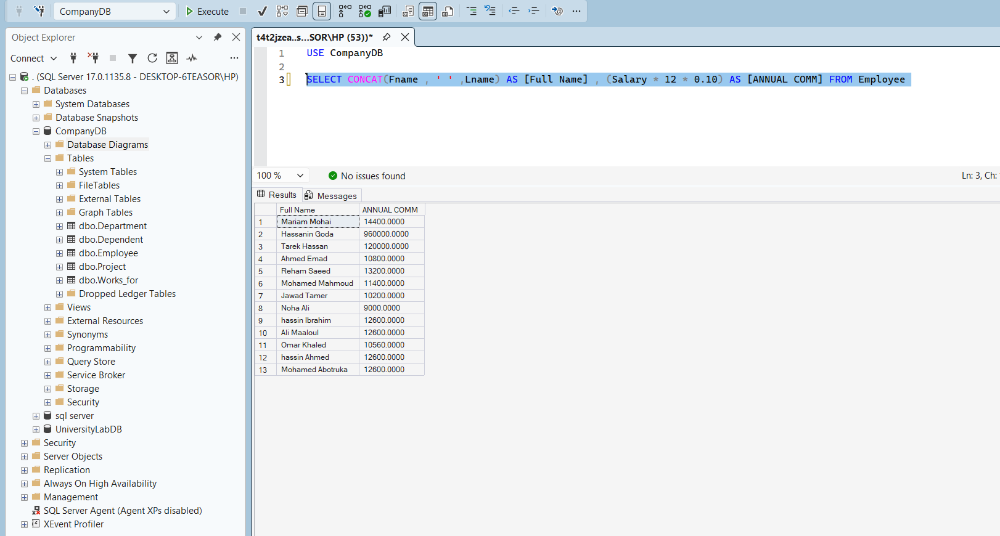 |
| **Task 5** | Display Employees Earning > 1000 LE | 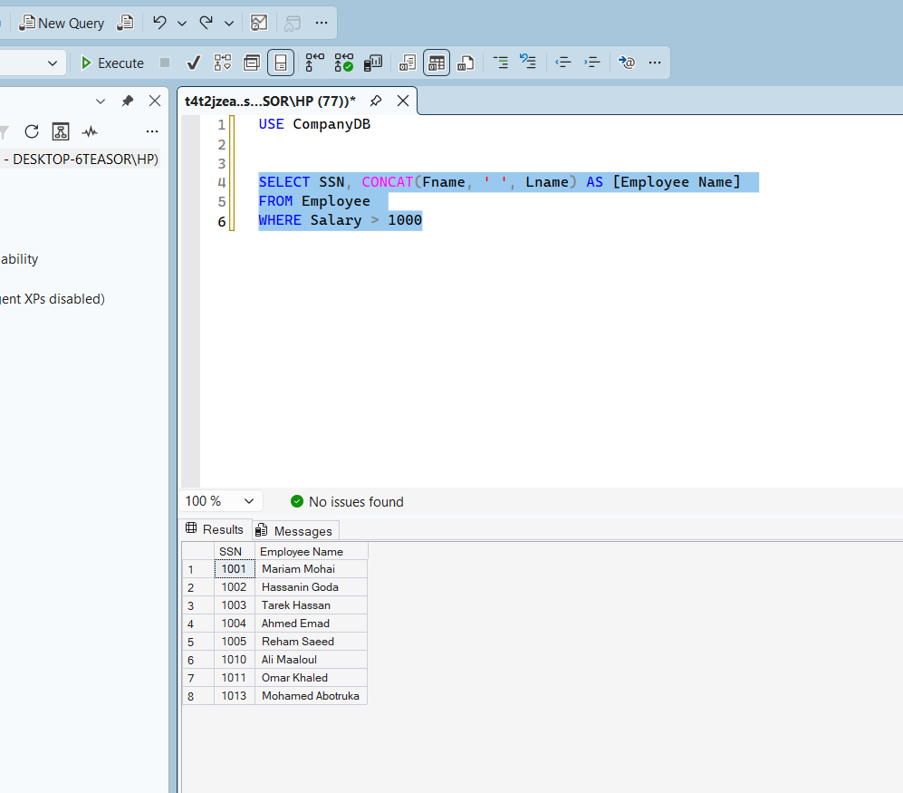 |
| **Task 6** | Display Employees Earning > 10,000 LE Annually | 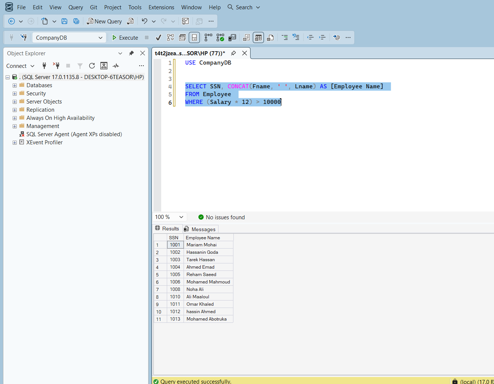 |
| **Task 7** | Display Female Employees Name and Salary | 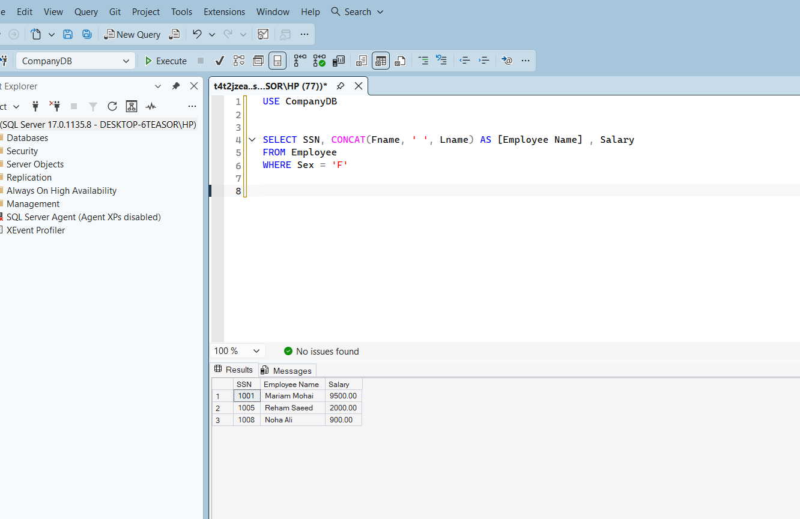 |
| **Task 8** | Display Projects Managed by Department 10 | 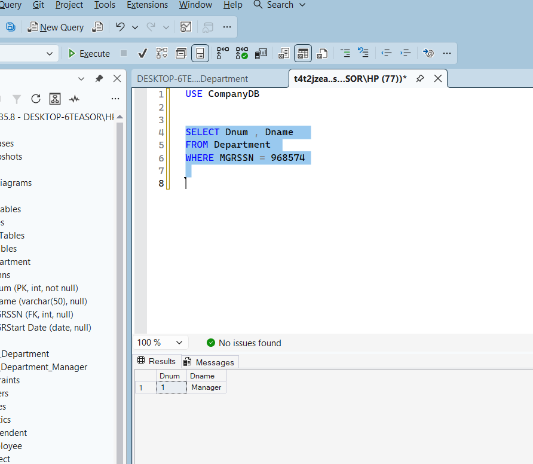 |
| **Task 9** | Display Departments Managed by Manager SSN 968574 | 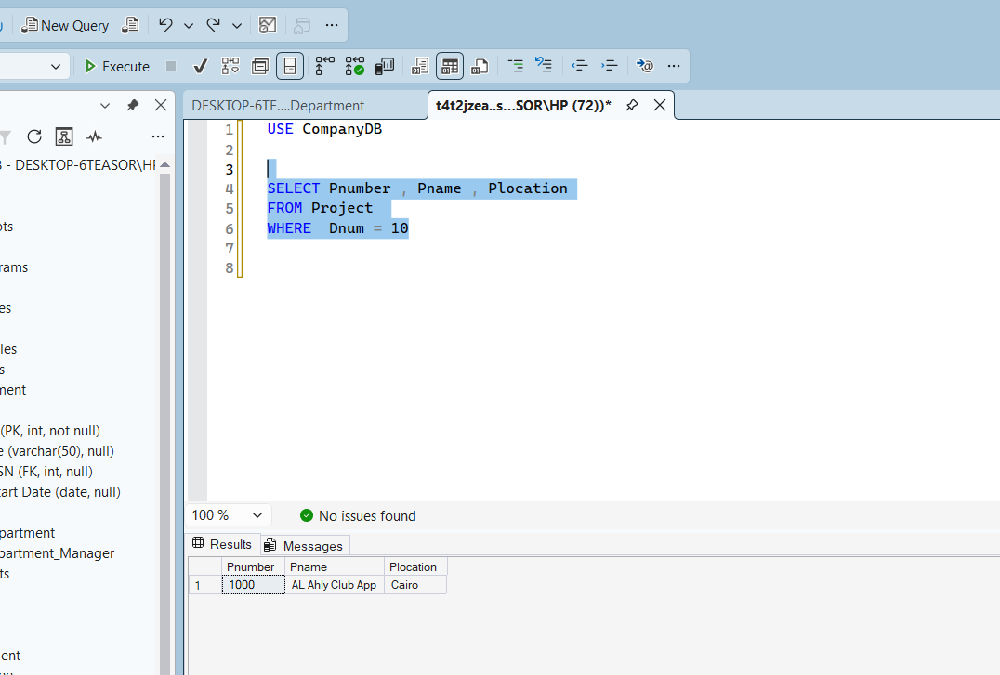 |

---

## 📂 Repository File Structure
```text
Lab2-CompanyDatabase-Schema/
├── script.sql              # Full T-SQL script (CREATE, INSERT, and SELECT queries)
├── Lab2_Part2.doc          # Lab instructions/document
├── Diagram.png             # SQL Server Generated Diagram
├── createtables.png        # Table Creation View
└── task1.png ... tasknine.png # Execution Output Screenshots